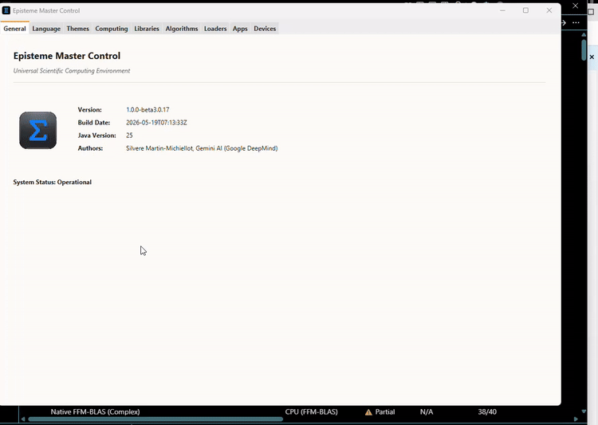
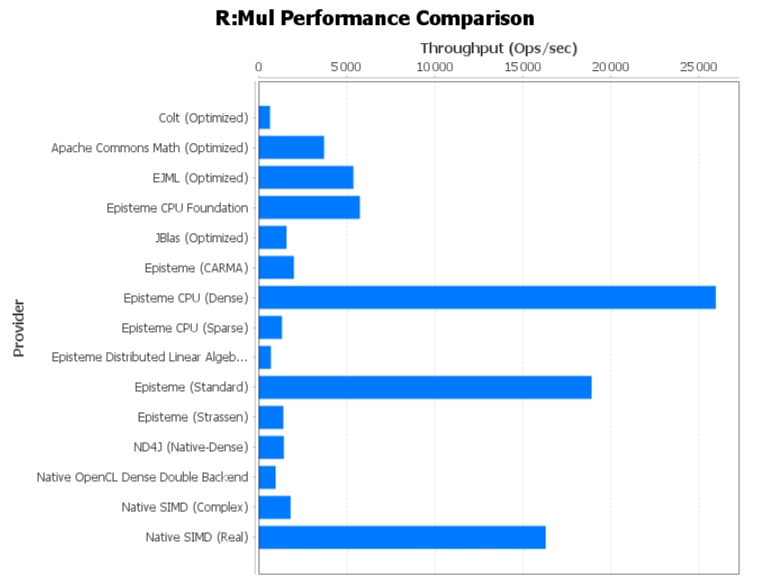

# 🌌 Episteme: The Unified Scientific Computing Framework

[](https://github.com/Episteme-HCP/Episteme)
[](https://www.oracle.com/java/technologies/downloads/)
[](LICENSE)
[](https://deepmind.google/technologies/antigravity/)

**Episteme** is a high-performance, modular, and comprehensive scientific computing library for Java. It reimagines JVM-based science by bridging the gap between low-level performance (C/C++) and high-level architectural elegance.

---

## 🚀 The Achievement
Developed over a relentless **5-month** sprint, Episteme comprises over **450,000+ lines** of production-ready code. This massive engineering undertaking was **built entirely with Antigravity**, demonstrating the power of agentic AI in scaling complex, science-first architectures.

---

## 📺 Introduction Video

Discover Episteme's modular ecosystem, dynamic backend autotuning, and robust scientific applications in our quick overview video:

<p align="center">
  <a href="https://github.com/user-attachments/assets/2be30ca0-1067-4b53-865a-793f36ea9136"></a>
</p>

*📺 The preview above autoplays and loops the entire 46-second demo. Click it to open the video with sound in a new tab.*

---

## 🔭 The Concept: Science-First Engineering
Most libraries are "computer-oriented"—built around arrays and pointers. Episteme is **"science-oriented"**.
*   **Natural Hierarchy**: Our object model mirrors the real world. Mathematics is the base for Physics, which in turn powers Biology and the Social Sciences.
*   **Semantic Reusability**: Complex scientific concepts are readily available via deep object hierarchies, allowing you to build entire domain-specific applications in just a few prompts.
*   **HPC on par with C**: Leverages Java Panama (21+) and the Vector API for direct native performance with zero deployment overhead.

---

## ✨ Key Features
*   🏎️ **Blazing Fast**: Up to **15x faster** on double-precision operations than EJML or Apache Commons Math.
*   ♾️ **Infinite Precision**: Arbitrary-precision numbers (MPFR) and complex domains supported natively.
*   📦 **Modular & Thin**: Release modules are ~1MB; add only the dependencies and compute backends you need.
*   🧠 **Autotuning Backends**: Plug-and-play support for CUDA, OpenCL, SIMD, and OpenBLAS. Backends are put into "competition" to ensure the fastest execution for your specific hardware.
*   🌐 **Distributed Grid**: Integrated worker nodes and gRPC-ready client/server architecture for scaling jobs across entire clusters.
*   🛠️ **Ready-to-Use**: Includes tens of loaders, viewers and external device drivers.
*   🌍 **I18n Supported**: Fully localized in English, French, German, Spanish, and Chinese (ZN).

---

## 📊 Performance Benchmarks

### Environment Sensitivity & Auto-Tuning
Linear algebra performance on the JVM is highly multi-dimensional. Throughput varies wildly depending on the virtualized cloud environment (AWS vs. GCP), underlying CPU extensions (such as AVX-512), matrix dimensions, and the specific operation (multiplication, inversion, decomposition). 

No single math backend is a silver bullet. A provider that excels at matrix multiplication on one cloud provider might throttle on another, or perform poorly on matrix inversion. 

Below is a factual, side-by-side comparison of **Real Matrix Multiplication (`R:Mul`)** throughput (Operations per Second) extracted directly from our GCP and AWS automated performance audits (`NORMAL` workload):

| Solver / Backend | AWS Throughput (Ops/sec) | GCP Throughput (Ops/sec) | Real-World Observations |
| :--- | :---: | :---: | :--- |
| **Episteme CPU (Dense)** | 3,267.2 | **25,968.5** | **Peak Performance Winner (GCP)**. Shows massive potential when hardware virtualization flags (e.g., AVX-512) are fully exposed, but can throttle under certain AWS hypervisors (~3.2k Ops/sec). |
| **Episteme (Standard)** | **18,036.8** | **18,914.1** | **Most Consistent High-Performance Backend**. Offers excellent, extremely stable throughput across both clouds. |
| **Native SIMD (Real)** | **16,537.5** | **16,305.4** | **Panama Vector API SIMD Backend**. Consistently high performance on both architectures with zero deployment overhead. |
| **Episteme CPU Foundation**| 5,870.1 | 5,755.5 | Consistent pure-Java baseline; outperforms or matches external libraries with no native bindings. |
| **EJML (Optimized)** | 6,214.2 | 5,384.0 | Pure-Java library; performs well for small to medium operations but lacks hardware-level vectorization. |
| **Apache Commons Math** | 8,874.3 | 3,722.9 | Solid baseline but performance scales poorly with larger or complex matrices. |
| **JBlas (Optimized)** | 5,104.0 | 1,592.2 | Native BLAS wrapper; highly volatile depending on OS-level system BLAS configuration. |
| **Native OpenCL Dense** | 1,394.8 | 966.0 | GPU/OpenCL backend; throughput is currently throttled by JNI overhead on small/medium workloads. |

### Why Episteme's Dynamic Auto-Tuner is Critical
This platform volatility is exactly why Episteme does not force a single solver. Episteme features a **Dynamic Auto-Tuning Manager** that:
1.  **Benchmarks Backends at Runtime**: Evaluates each available provider (SIMD, OpenCL, CUDA, standard Java) on the active hardware.
2.  **Scores by Context**: Evaluates the specific operation, data type (Real/Complex), and matrix size.
3.  **Applies Real-Time Competition**: Dynamically routes execution to the fastest available backend for that exact task, mitigating the volatility shown in the table above.

<p align="center">
  
</p>

## 💼 Career Note
**I am currently looking for a full-time job.**  
If you are impressed by the scale and quality of Episteme and are looking for a dedicated software engineer with experience in high-performance computing and AI-driven development, please reach out via GitHub or [LinkedIn](https://www.linkedin.com/in/silv%C3%A8re-martin-michiellot-65b6a95/).

---

## 🛠️ Getting Started

### Installation
Add Episteme to your `pom.xml`:
```xml
<dependency>
    <groupId>io.github.episteme-hcp</groupId>
    <artifactId>episteme-core</artifactId>
    <version>1.0.0-beta3</version>
</dependency>
```

### High-Precision Linear Algebra
```java
// QR Decomposition with 128-bit precision
Matrix<RealBig> A = Matrix.rand(100, 100, RealBig.RING);
QRResult<RealBig> qr = A.qr();
System.out.println("Residual: " + A.subtract(qr.Q().multiply(qr.R())).norm());
```

 
## Module Structure

```text
episteme/
├── episteme-core/          # Mathematics, I/O, common utilities
│   ├── mathematics/        # Linear algebra, calculus, statistics
│   ├── measure/            # Quantities, units (JSR-385)
│   ├── bibliography/       # Citation management, CrossRef
│   └── ui/                 # Demo launcher, Matrix viewers
├── episteme-natural/       # Natural sciences (34 demos)
│   ├── physics/            # Mechanics, thermodynamics, astronomy
│   ├── chemistry/          # Molecules, reactions, biochemistry
│   ├── biology/            # Genetics, evolution, ecology
│   └── earth/              # Geology, meteorology, coordinates
├── episteme-social/        # Social sciences (11 demos)
│   ├── economics/          # Markets, currencies, models
│   ├── geography/          # GIS, maps, demographics
│   └── sociology/          # Networks, organizations
├── episteme-killer-apps/   # Advanced applications (10 demos)
│   ├── biology/            # CRISPR Design, Pandemic Forecaster
│   ├── physics/            # Quantum Circuits, Relativity
│   └── chemistry/          # Titration, Crystal Structure
└── episteme-benchmarks/    # JMH performance benchmarks
```

## Data Loaders

External data sources with built-in caching (TTL: 24h):

| Module | Loaders |
| --- | --- |
| Astronomy | `NasaExoplanets`, `SimbadLoader`, `SimbadCatalog` |
| Biology | `GbifTaxonomy`, `GenBank`, `NcbiTaxonomy` |
| Chemistry | `PubChem` |
| Earth | `OpenWeather`, `UsgsEarthquakes` |
| Economics | `WorldBank` |
| Bibliography | `CrossRef` |

## Architecture

See [ARCHITECTURE.md](docs/ARCHITECTURE.md) for complete design.
[Architecture Diagrams (Mermaid)](docs/mermaid/README.md)

**Core Principles:**

1. **Performance First**: Primitives by default, objects when needed
2. **Scientific Accuracy**: Respect mathematical and physical concepts
3. **Ease of Use**: Domain scientists shouldn't need to know lower layers
4. **Flexibility**: Switch precision/backends without code changes

## Documentation

- 📚 **Online API Javadoc**: [https://episteme-hcp.github.io/Episteme/javadoc/index.html](https://episteme-hcp.github.io/Episteme/javadoc/index.html)
- [Architecture Guide](docs/ARCHITECTURE.md)
- [Mathematical Concepts](docs/VISION.md)
- [API Reference](docs/REST_API.md)
- [Examples](docs/EXAMPLES.md)
- [Contributing Guide](docs/CONTRIBUTING.md)

## Requirements

- **Java 25** (Required to compile the high-performance native backend module `episteme-native` due to finalized modern Panama FFM APIs).
- **Java 21+** (Compatible for building and running all core mathematical and social modules: `episteme-core`, `episteme-natural`, `episteme-social`, `episteme-database`, by excluding `episteme-native` via Maven reactor exclusions `-pl '!episteme-native,!episteme-server,!episteme-client,!episteme-worker,!episteme-demos,!episteme-featured-apps,!episteme-benchmarks'`).
- Maven 3.8+
- (Optional) CUDA Toolkit 12.0+ for GPU support

## License

MIT License - see [LICENSE](LICENSE) file.

## Credits

- **Original Vision**: Silvere Martin-Michiellot
- **Implementation**: Gemini AI (Google DeepMind)

## Contributing

We welcome contributions!---

*© 2025-2026 Silvere Martin-Michiellot. Built with Antigravity.*
